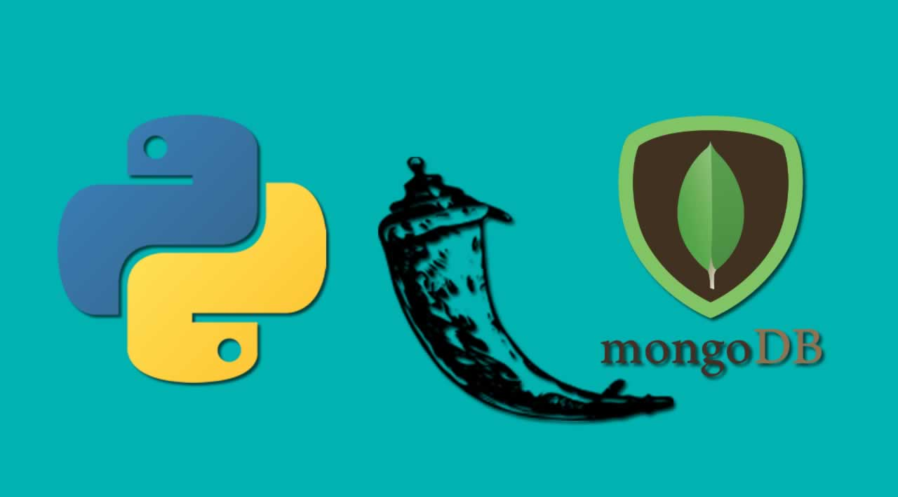

# Introduction
## About RESTful API
- A RESTful API (also known as REST API) is an application programming interface (API or web API).
- It a way for two computer systems to communicate over HTTP in a similar way to web browsers and servers. 
- REST stands for representational state transfer.  
### A RESTful web service request contains: 
**An Endpoint URL**: An application implementing a RESTful API will define one or more URL endpoints with a domain, port, path, and/or &nbsp;&nbsp;&nbsp;&nbsp;&nbsp;&nbsp;querystring — for example,    https://mydomain/user/123?format=json.

**The HTTP method**: Differing HTTP methods can be used on any endpoint which map to application create, read, update, and delete (CRUD) operations:

- HTTP method	CRUD	Action
- GET	read	returns requested data
- POST	create	creates a new record
- PUT or PATCH	update	updates an existing record
- DELETE	delete	deletes an existing record

**Body Data**: Data is normally transmitted in the HTTP body in an identical way to HTML (form) submissions or by sending a single 
&nbsp;&nbsp;&nbsp;&nbsp;&nbsp;&nbsp;JSON-encoded data string.

### Flask Installation in Python 
> pip install flask
### Flask RESTful Installation in Python
> pip install flask-restful

## About MongoDB Atlas
- MongoDB Atlas is a cloud-based, open-source, NoSQL database that uses JSON documents with dynamic schemas, serving as an alternative to table databases.
- Atlas provides all the features of MongoDB, while automating database administration tasks such as database configuration, infrastructure provisioning, patches, scaling events, backups, and more, freeing up developers to focus on what matters to them most.
- MongoDB Atlas also provides the dual benefit of flexibility and scalability.

### Pricing
- #### Free Tier (In Use)
  - MongoDB offers a free tier that users can use for learning, prototyping, and early deployment. This free edition called M0 Sandbox is limited to 512MB of storage, shared vCPU  and RAM, 100 max connections, and a limit of one M0 cluster.

### Getting Started with MongoDB Atlas
- You can refer to this link for better understanding: https://www.knowi.com/blog/getting-started-with-mongodb-atlas-overview-and-tutorial/

## About Docker

- Docker is an open source project that makes it easy to create containers and container-based apps.
- It provides a small and lightweight execution environments that make shared use of the operating system kernel but otherwise run in isolation from one another.

### Components of Docker
#### Dockerfile
- Each Docker container starts with a Dockerfile. A Dockerfile is a text file written in an easy-to-understand syntax that includes the instructions to build a Docker image (more on that in a moment).
- A Dockerfile specifies the operating system that will underlie the container, along with the languages, environmental variables, file locations, network ports, and other components it needs—and, of course, what the container will actually be doing once we run it.

#### Docker Image
- Once you have your Dockerfile written, you invoke the Docker build utility to create an image based on that Dockerfile.
- A Docker image is a portable file containing the specifications for which software components the container will run and how.

#### Docker Container
- Docker’s run utility is the command that actually launches a container.
- Each container is an instance of an image.
- Containers are designed to be transient and temporary, but they can be stopped and restarted, which launches the container into the same state as when it was stopped.

# Get Started

### MongoDB Atlas Registeration
Firstly, register youself on [MongoDB Atlas](https://www.mongodb.com/cloud/atlas?jmp=partners_knowi) and create a connection with your cluster.

After a successful creation of the connection we'll get a URI string, and with the help of that we gonna connect our cluster with the flask application.

URI string example:
> mongodb+srv://&ltUsername&gt:'&ltpassword&gt'@&ltClusterName&gt.csb3w.mongodb.net/&ltDatabaseName&gt?retryWrites=true&w=majority

Tutorial : https://www.knowi.com/blog/getting-started-with-mongodb-atlas-overview-and-tutorial/

